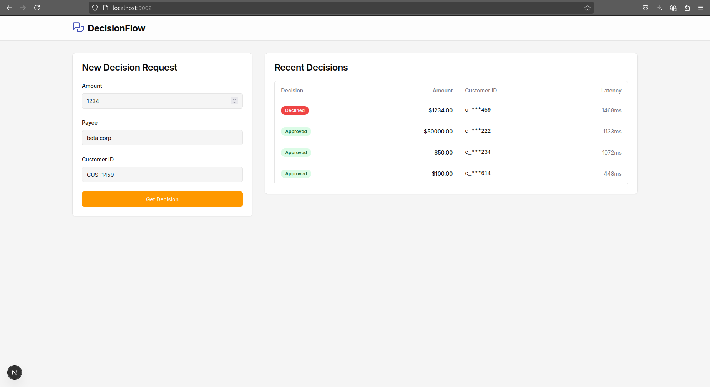
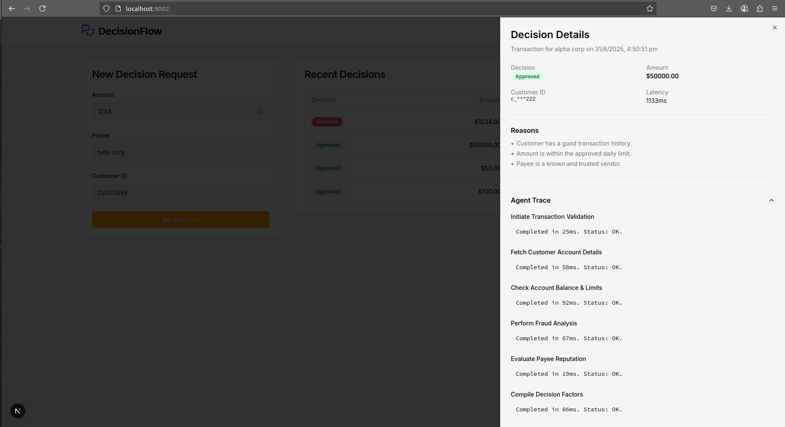

# Agent Decision Viewer

This project is a small dashboard for viewing decisions from a simulated agentic service, built with Next.js, TypeScript, and Tailwind CSS.




### ✨ Key Features

* Submit a decision request and see results in real-time.
* View a history of the last 20 decisions in a clean, sortable table.
* Click on any decision to open a detailed drawer with reasoning and a complete agent trace.
* Responsive design with loading skeletons and empty states for a smooth user experience.

---

### 🚀 Getting Started

Follow these steps to get the development environment running on your local machine.

#### 1. Install Dependencies

```bash
npm install
```

#### 2. Run the Development Server

```bash
npm run dev
```

Open [http://localhost:9002](http://localhost:9002) with your browser to see the application.


---

### 💡 Technical Decisions & Trade-offs

This project was built with specific constraints and goals in mind, leading to the following technical decisions:

* **State Management**: I chose to use **local component state (`useState`)** instead of a global state manager like Zustand or Redux. For an application of this small scale, local state is simpler, requires no extra dependencies, and avoids unnecessary boilerplate. The trade-off is that this approach wouldn't scale well if more components needed to share the same state.

* **UI Components**: I used **Shadcn/UI**, which provides accessible and composable components built on top of Radix UI. This significantly sped up development and ensured accessibility best practices (like keyboard navigation and focus management) were handled out-of-the-box. The alternative—building components from scratch—would have been far more time-consuming.

* **Performance Optimization**: I implemented a **debounce on the form submission button** using a custom hook. I chose this over memoizing table rows because it addresses a more critical performance concern: preventing a user from spamming the API with duplicate requests. This improves the user experience and reduces server load, which is a more significant bottleneck in this context.

* **API Mocking**: I used a **Next.js API Route (`/api/decide`)** to create a self-contained mock backend. This makes the project incredibly easy to set up and run, as it doesn't rely on any external services. The trade-off is that it's less flexible than a dedicated mocking library like MSW, which could provide more advanced testing scenarios.
